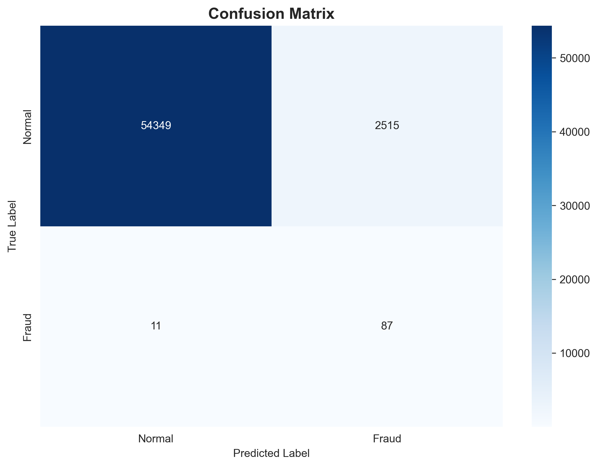
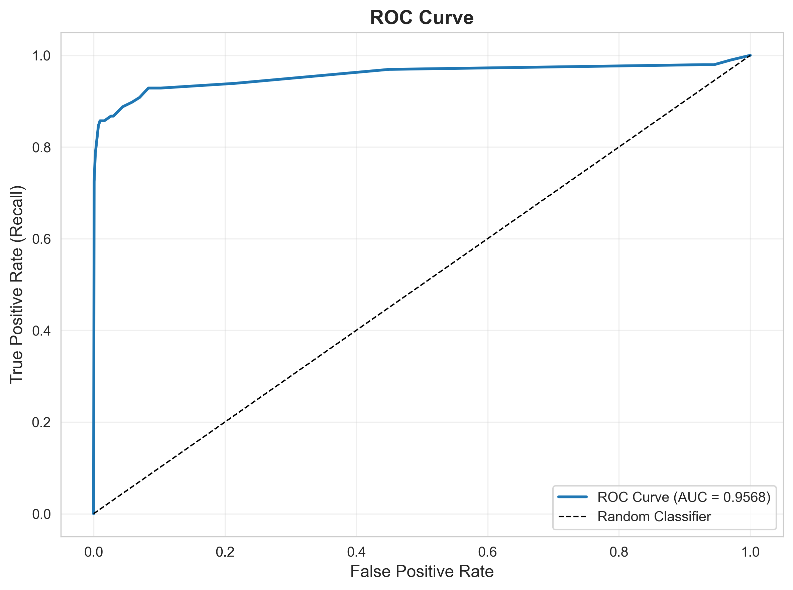
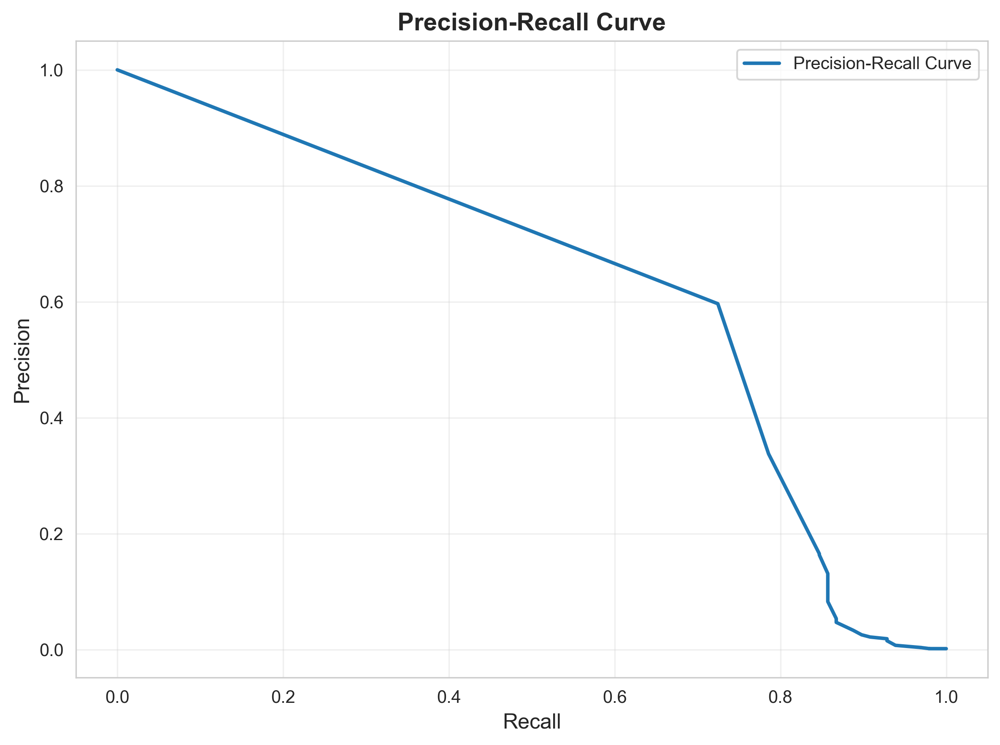
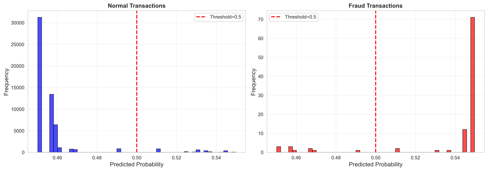
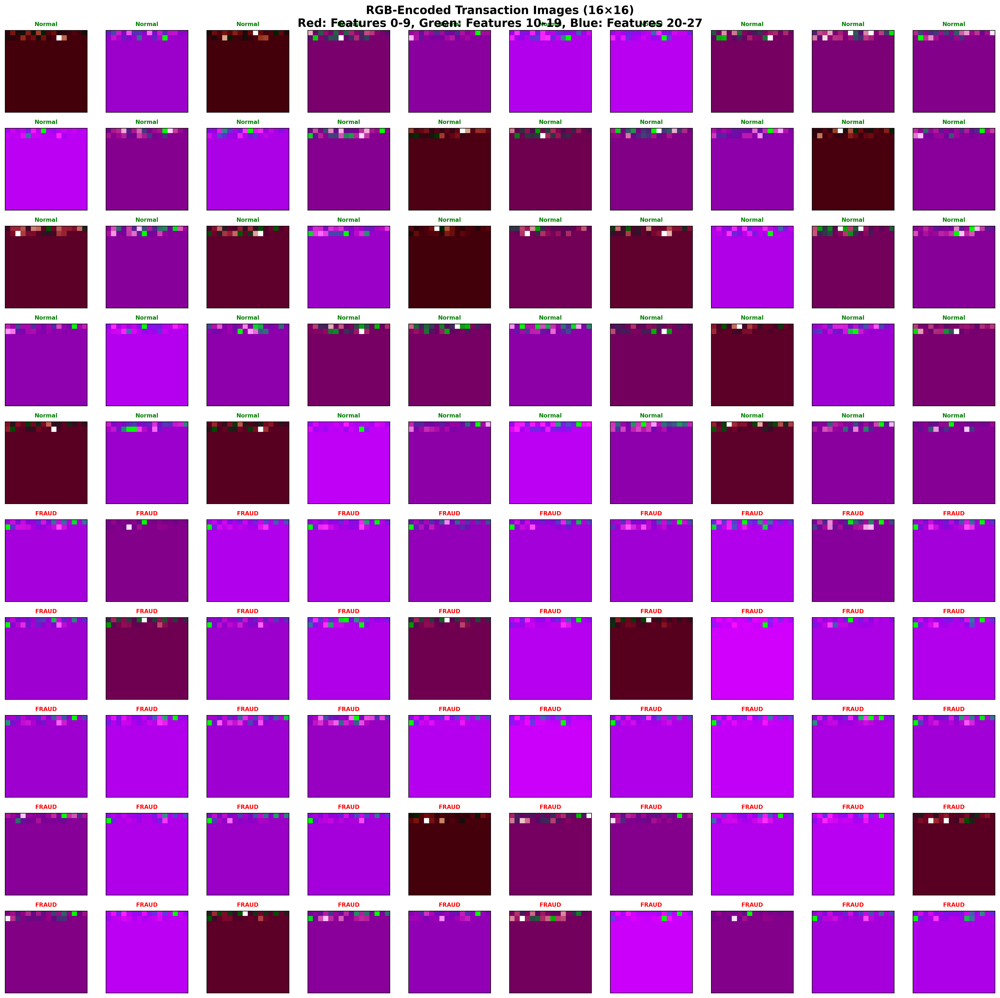
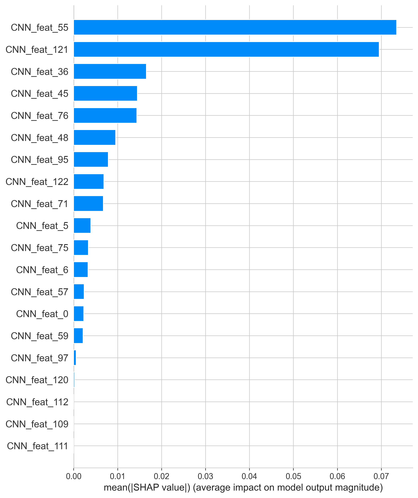

# CSV-to-Image Encoding for Credit Card Fraud Detection using CNN and XGBoost

A hybrid deep learning approach for fraud detection that converts tabular credit card transaction data into RGB images, trains a CNN for feature extraction, and uses XGBoost for final classification.

## Table of Contents

- [Project Overview](#project-overview)
- [Results](#results)
- [Project Structure](#project-structure)
- [Usage](#usage)
- [Methodology](#methodology)
- [Key Findings](#key-findings)
- [Technical Details](#technical-details)
- [Dataset](#dataset)
- [Requirements](#requirements)
- [License](#license)
- [Acknowledgments](#acknowledgments)
- [Contact](#contact)


##  Project Overview

This project implements a novel approach to fraud detection by:
1. **Encoding** tabular features as 16×16 RGB images using the formula: R=x, G=x², B=x³
2. **Training** a CNN to extract 128-dimensional feature vectors from these images
3. **Using** XGBoost on CNN features for final fraud classification

## Results

### Performance Metrics
- **ROC-AUC**: 0.9568 (95.68%)
- **Recall**: 88.78% (catches 87 out of 98 fraud cases)
- **False Negative Rate**: 11.22%
- **Precision**: 3% (expected with 0.172% fraud ratio)

### Confusion Matrix


### ROC Curve


### Precision-Recall Curve


### Prediction Distribution


### RGB-Encoded Transaction Images


*Sample of 100 transactions (50 normal + 50 fraud) showing the 16×16 RGB encoding*

### SHAP Feature Importance




##  Project Structure

```
PROJECT/
│
├── src/
│   ├── config.py               # Configuration and hyperparameters
│   ├── preprocess.py           # Data loading, normalization, and image encoding
│   ├── cnn_model.py            # CNN architecture (16×16×3 → 128-D)
│   ├── train_cnn.py            # CNN training script
│   ├── train_xgboost.py        # Feature extraction and XGBoost training
│   ├── evaluate.py             # Evaluation with metrics and visualizations
│   └── visualize_rgb_images.py # RGB image grid generator
│
├── models/
│   ├── cnn_feature_extractor.h5    # Frozen CNN (0.4 MB)
│   ├── cnn_training_best.h5        # Best CNN checkpoint (1.13 MB)
│   └── xgboost_model.pkl           # Trained XGBoost (30.81 KB)
│
├── output/
│   └── visualization/
│       ├── confusion_matrix.png
│       ├── roc_curve.png
│       ├── precision_recall_curve.png
│       ├── prediction_distribution.png
│       ├── rgb_encoded_images_grid.png
│       ├── shap_summary.png
│       ├── shap_feature_importance.png
│       └── evaluation_report.txt
│
├── requirements.txt
├── README.md
└── .gitignore
```


##  Usage

### 1. Data Preparation
```bash
cd src
python preprocess.py
```
This will:
- Load train.csv and test.csv
- Normalize features using RobustScaler (fitted on training data)
- Encode each row as a 16×16 RGB image (R=x, G=x², B=x³)
- Generate image tensors in memory (~52.69 MB total)

### 2. Train CNN Feature Extractor
```bash
python train_cnn.py
```
This will:
- Train CNN on image-encoded data (CPU-only)
- Optimize for recall using class weighting
- Apply early stopping (patience=3)
- Save frozen feature extractor (128-D output)

**Expected output**: Best validation recall ~100%, saved to `models/cnn_feature_extractor.h5`

### 3. Train XGBoost
```bash
python train_xgboost.py
```
This will:
- Extract 128-D features from all images using frozen CNN
- Train XGBoost with scale_pos_weight for imbalance
- Save trained model to `models/xgboost_model.pkl`

**Expected output**: ROC-AUC ~0.9568

### 4. Evaluate Pipeline
```bash
python evaluate.py
```
This will:
- Run inference on test set (no retraining)
- Generate all visualizations
- Create SHAP explanations
- Save results to `output/visualization/`

##  Methodology

### Image Encoding Strategy

Each transaction (28 features: V1-V28) is encoded as a **16×16 RGB image**:

- **Normalization**: RobustScaler (handles outliers, fitted on train only)
- **Pixel mapping**: 28 features → first 28 pixels (row-major order)
- **RGB formula**: 
  - R = x (feature value)
  - G = x² (squared)
  - B = x³ (cubed)
- **Zero padding**: Remaining 228 pixels are black
- **Memory**: ~52.69 MB for all images (float32)

### CNN Architecture (Locked)

```
Input: 16×16×3
↓
Conv2D(32, 3×3, padding=same) → ReLU → BatchNorm
↓
Conv2D(64, 3×3, padding=same) → ReLU → BatchNorm → MaxPool(2×2)
↓
Conv2D(128, 3×3, padding=same) → ReLU → BatchNorm
↓
Global Average Pooling
↓
Output: 128-dimensional feature vector
```

**Training**:
- Optimizer: Adam (lr=0.001)
- Loss: Binary Cross-Entropy
- Batch size: 64
- Epochs: 10 (early stopping)
- Class weighting: Applied for recall optimization
- Device: CPU-only

### XGBoost Configuration

```python
{
    'objective': 'binary:logistic',
    'max_depth': 5,
    'learning_rate': 0.1,
    'scale_pos_weight': 577.88,  # Handles 0.172% fraud ratio
    'n_estimators': 100,
    'early_stopping_rounds': 10
}
```

## Key Findings

### Strengths
- **Excellent discrimination** (ROC-AUC: 0.9568)  
- **High recall** (88.78% fraud detection)  
- **Low false negatives** (only 11 fraud cases missed)  
- **Production-feasible** prototype for real-world fraud detection.  

### Trade-offs
- **Low precision (3%) - High false positive rate**, Precision is reported at a recall-optimized threshold (0.5) and is expected to be low given the 0.172% fraud ratio 
- **Expected with extreme imbalance** (0.172% fraud)  
- **Acceptable in fraud detection** (missing fraud is costlier than false alarms)  

### Interpretation
The model is optimized for **recall**, successfully catching ~89% of fraud cases. The low precision is acceptable because:
- Missing a fraud case costs much more than a false alarm
- False positives can be reviewed manually
- The extreme class imbalance (577:1) makes high precision difficult

##  Technical Details

### No Data Leakage
-  Normalization fitted on training set only
-  Test set never used for training
-  CNN weights frozen during XGBoost training
-  Stratified split preserves fraud ratio

### Memory Optimization
- Image tensors: float32 (4 bytes per value)
- Total memory: ~52.69 MB (under 60 MB constraint)
- Batch processing for feature extraction

### Reproducibility
- Random seed: 42 (set globally)
- Deterministic feature ordering
- Frozen model weights saved

##  Dataset

**Source**: Credit Card Fraud Detection Dataset  
**Total transactions**: 284,807  
**Fraud ratio**: 0.172% (492 fraud cases)  
**Features**: V1-V28 (PCA-transformed), Time, Amount  
**Split**: 80% train (227,845) / 20% test (56,962)  

##  Requirements

- Python 3.11+ (tested on 3.13.9)
- TensorFlow 2.13+
- XGBoost 2.0+
- scikit-learn 1.3+
- pandas 2.0+
- numpy 1.24+
- matplotlib 3.7+
- seaborn 0.13+
- shap 0.44+

**Note**: While this project was developed with Python 3.13, Python 3.11 or 3.12 is recommended for better library compatibility.

See `requirements.txt` for complete list.

##  License

MIT

## Acknowledgments

- Dataset: [Kaggle Credit Card Fraud Detection](https://www.kaggle.com/mlg-ulb/creditcardfraud)
- Inspired by image-based approaches to tabular data

## Contact

For questions or feedback, please open an issue.

---

**Note**: This project demonstrates that converting tabular data to images can be effective for fraud detection, achieving 95.68% ROC-AUC with a hybrid CNN + XGBoost approach.
